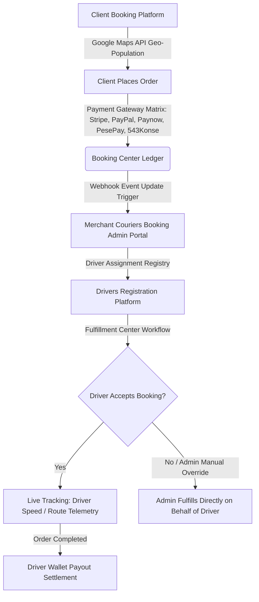

# Architectural Case Study: Enterprise Core-PHP On-Demand Logistics & Fleet Management System

## 📌 Executive & Transaction Summary
This repository delivers a comprehensive technical case study and architectural retrospective of an enterprise **On-Demand Courier, Logistics, and Automated Dispatch Platform** engineered from the ground up using framework-free **Core Object-Oriented PHP, MySQL, and Vanilla JavaScript**.

*   **Venture Lifecycle:** Deployed in 2017, the application was operated continuously in a live commercial market for seven years, processing real-time telemetry, routing multi-currency logistics, and scaling fleet operations.
*   **The AI Engineering Phase (2024–2026):** I assumed direct control of the core architecture to refactor legacy technical debt, eliminate hardcoded dependencies, and embed robust security paradigms. This phase was accelerated using an advanced generative engineering stack (**Visual Studio Code, GitHub Copilot, Claude, GPT-4, and Grok**).
*   **Commercial Exit:** The completely modernized infrastructure and software intellectual property were successfully acquired in **August 2026** by a private buyer who wanted to acauire business in a technology driven transport delivery services business.

*Note: To protect proprietary IP and commercial operations following the asset acquisition exit, this repository serves strictly as an isolated architectural blueprint, design pattern log, and structural schema retrospective. Code contribution history is available via verified organization repository references.*

---

## 📐 Platform Core Functionality & Request Lifecycle

The platform operates as a cohesive digital ecosystem connecting three primary user interfaces: **Merchant Couriers Booking Platform 🔄 Drivers Registration Platform 🔄 Client Booking Platform**. 

The operational flow maps out through explicit system environments:
1. **BOOKING CENTER:** Client Books Order ➡️ Address Geo-Population via Google Maps API ➡️ Client Pays For Booking (Dynamic Gateway Routing).
2. **FULFILLMENT CENTER:** Driver Views Available Bookings ➡️ Driver Accepts Booking ➡️ Driver Fulfills Booking (Live Real-Time Telemetry Tracking) ➡️ Driver Settled / Paid.

---

## 🛠️ Complete Feature Specification & Core Architecture

To maximize the commercial valuation of the platform prior to acquisition, the codebase underwent a rigorous architectural transformation. Below are the exact features engineered into the web application system:

### 1. Advanced Data Views & Driver Assignment Controls
*   **Core Tables Separation:** Segregated system data into optimized, heavily paginated data layers (`Separate Bookings Table Page` and `Separate Customer Table Page`) to minimize server memory allocation.
*   **Admin-to-Driver Messaging Interface:** Built a direct admin-to-driver secure messaging utility page, bypassing external communication costs and centralizing operational instructions.
*   **Administrative Fulfillment Bypass:** Engineered an overriding structural rule allowing system admins to assign orders to drivers and directly fulfill orders from the Admin Portal on behalf of an assigned driver when network or device errors occur in the field.

### 2. High-Fidelity Administrative Dashboard Analytics
*   **Main Dashboard Statistics Matrix:** Refactored the core dashboard to display high-fidelity analytics tracking statistics cards for sales, orders, drivers, cancellations, and Progressive Web App (PWA) download choices segmented across individual user portals (Customer, Admin, Driver).
*   **Dynamic Services Toggle Control:** Implemented an enterprise-grade switch allowing the administrator to enable or disable specific operational service types (`Parcel`, `Freight`, `Furniture`, `Tow Truck`, and `Taxi`) instantly within the booking portal based on fleet asset availability.

### 3. Asynchronous Communications & Batch Warning Engine
*   **System-Wide Notifications Portal:** Separated transactional message frameworks from core backend code. All system notifications, service notifications, and driver notifications are entirely editable from the Admin Portal interface, replacing hardcoded strings.
*   **Enhanced Invitation Alerts Engine:** Designed an invitation manager page built with multiple form layouts and bulk invitation scripts via spreadsheet upload, implementing batch processing mechanics for spam management.
*   **Multi-Channel Enhanced Customer Alerts:** Embedded a dual-engine warning layout allowing alerts to be targeted to specific customers or multiple customers using batch processing. Includes full SMS and email configuration paths with support for both raw text or rich HTML emails.

### 4. Global Fintech Gateway Engine & Cross-Border Billing
*   **Dynamic Currency Tokenization:** Rewrote the booking management invoice components to map regional currency formatting, dynamic symbol updates, and multi-currency values contextually to client invoices.
*   **Dynamic Payment Gateway Switch Matrix:** Deployed a comprehensive API settings console supporting a highly flexible global payment gateway array: **Stripe, PayPal, Paynow (Zimbabwe), PesePay (Zimbabwe), and 543 Konse (Zambia)**. Gateways are displayed dynamically at checkout based on the specific activated gateway toggled by the system administrator.
*   **Credential Security Hashing:** Engineered the API configurations engine to manage live and test keys with an integrated security feature that obfuscates and hides production keys through hashing, alongside the ability to instantly switch between live and test environments for payment and SMS gateways.
*   **Sandbox Testing Architecture:** Embedded an isolated sandbox test environment populated with custom testing accounts, enabling development partners to audit customer checkouts and driver fulfillment workflows safely without altering live accounting ledgers.

### 5. Geospatial Telemetry, Frontend Controls & Identity Verification
*   **Enhanced Booking Management UI:** Integrated a robust geospatial tracking page utilizing the **Google Maps API** to handle drop-off/pick-up address geo-population, live order map tracking, driver assignment capabilities, estimated time of arrival (ETA) predictions, driver speed monitoring, route tracking, and automated driver performance metrics.
*   **Dynamic Frontend CMS Capabilities:** Integrated dynamic administration modules to update critical frontend system pages natively (Terms and Conditions, Privacy Policies, API Terms, and Google Review listings via custom Google Place ID markers).
*   **SEO & Open Graph Control Board:** Added an advanced configuration panel allowing system admins to actively manipulate meta titles, meta descriptions, reCAPTCHA diagnostics, and social media Open Graph sharing links, titles, and descriptions at the edge.
*   **Progressive Web App (PWA) Delivery:** Deployed deep mobile browser optimization by compiling a custom service worker, giving users an optimized Progressive Web App download option for adding the portal onto a mobile device home screen.
*   **Firebase Secure Identity Protocol:** Integrated **Google Firebase Authentication Key Infrastructure**, routing user registration sequences through secure, carrier-validated One-Time Passwords (OTP) to enforce authentication security across all signup structures.
*   **In-App Notification Hub:** Engineered an internal notification delivery pipeline including an in-app notifications page and an immediate notification alert icon in the top header menu.
*   **Role-Based Access Controllers (RBAC):** Built strict access management layers supporting multiple administrative roles, isolating dangerous system screens and restricting designated configuration panels from lower-tier users.
