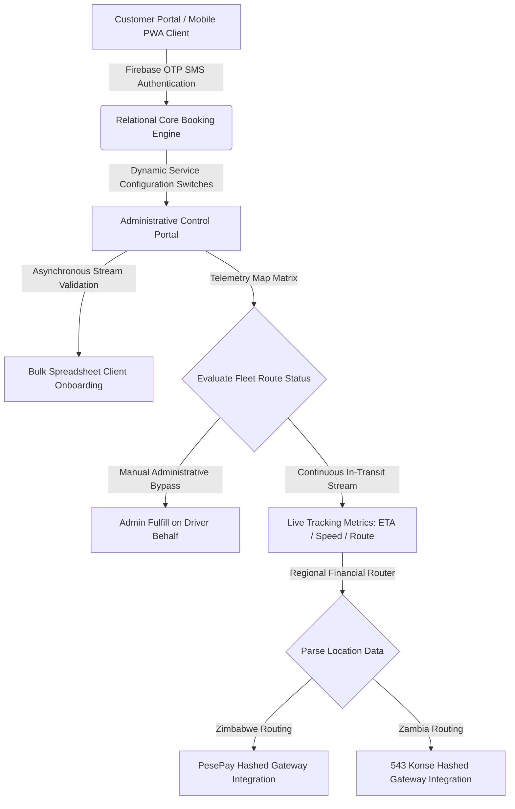

# Architectural Case Study: Enterprise Core-PHP On-Demand Logistics & Fleet Management System

## 📌 Executive & Transaction Summary
This repository delivers a comprehensive technical case study and architectural retrospective of an enterprise **On-Demand Courier, Logistics, and Automated Dispatch Platform** engineered from the ground up using framework-free **Core Object-Oriented PHP, MySQL, and Vanilla JavaScript**.

*   **Venture Lifecycle:** Deployed in 2017, the application was operated continuously in a live commercial market for seven years, processing real-time telemetry, routing multi-currency logistics, and scaling fleet operations.
*   **The AI Engineering Phase (2024–2026):** I assumed direct control of the core architecture to refactor legacy technical debt, eliminate hardcoded dependencies, and embed robust security paradigms. This phase was accelerated using an advanced generative engineering stack (**Visual Studio Code, GitHub Copilot, Claude, GPT-4, and Grok**).
*   **Commercial Exit:** The completely modernized infrastructure and software intellectual property were successfully acquired in **August 2026** by a private transport group expanding their automated delivery footprint.

*Note: To protect proprietary IP and commercial operations following the asset acquisition exit, this repository serves strictly as an isolated architectural blueprint, design pattern log, and structural schema retrospective. Code contribution history is available via verified organization repository references.*

---

## 📐 Unified Request & Transaction Lifecycle

---

## 🛠️ System Evolution: Legacy Infrastructure vs. Modernized Fleet Stack

To maximize the commercial valuation of the platform prior to acquisition, the codebase underwent a rigorous architectural transformation. Below is the structural layout of the platform's evolution:

### 1. Booking, Fleet Management & Telemetry Engine
*   **Legacy Infrastructure (Pre-Refactor):** Basic customer registries and static booking records. Admin tracking relied on basic database queries with manual entry validation.
*   **Modernized Fleet Stack (AI-Accelerated):** 
    *   **Administrative Driver-Bypass Control:** Engineered an overriding structural rule allowing system admins to directly assign orders to drivers and fully fulfill tickets from the Admin Portal on behalf of an active driver when network or device disconnects occur in the field.
    *   **Advanced Telemetry Interface:** Integrated live geospatial tracking to monitor vehicle velocity, route adherence, dynamic Estimated Time of Arrival (ETA) updates, and automated driver performance logs.
    *   **Internal Communication Nodes:** Built a direct admin-to-driver secure messaging interface, bypassing external communication costs and centralizing operational instructions.

### 2. Administrative Control & Dashboard Analytics
*   **Legacy Infrastructure (Pre-Refactor):** Standard text summaries detailing basic order volumes and database entries.
*   **Modernized Fleet Stack (AI-Accelerated):**
    *   **High-Fidelity Statistical Matrix:** Refactored the core dashboard to display real-time analytics tracking total sales volumes, processing orders, active field drivers, cancellations, and Progressive Web App (PWA) deployment metrics segmented across individual user portals (Customer, Admin, Driver).
    *   **Isolated Data Presentation:** Separated primary application data views into discrete, heavily paginated data layers (`Separate Bookings Table Page` and `Separate Customer Table Page`) to minimize server memory allocation.
    *   **Modular Service Switches:** Implemented an enterprise-grade toggle matrix allowing the administrator to enable or disable specific operational lines (`Parcel`, `Freight`, `Furniture`, `Tow Truck`, and `Taxi`) instantly on the frontend booking interface depending on resource capacity.

### 3. Asynchronous Communications & Batch Warning Protocols
*   **Legacy Infrastructure (Pre-Refactor):** Hardcoded email strings inside system controllers and manual customer contact procedures.
*   **Modernized Fleet Stack (AI-Accelerated):**
    *   **Dynamic Notification Engine:** Built a system-wide notifications portal separating transactional message frameworks from core code. System alerts, driver metrics, and service notices are entirely editable from the interface via text or raw HTML parameters.
    *   **Bulk Invitation Engine:** Designed a spreadsheet parser (`.csv/.xlsx`) capable of executing asynchronous bulk onboardings. Included dynamic throttling algorithms to prevent server IP throttling and secure spam-management safety barriers.
    *   **Multi-Channel Client Alerts:** Embedded a dual-engine warning layout capable of firing batch text or rich HTML emails to isolated user targets simultaneously using background cron queues.

### 4. FinTech Gateway Matrix & Cross-Border Billing
*   **Legacy Infrastructure (Pre-Refactor):** Fixed local currency variables and brittle single-gateway pathways.
*   **Modernized Fleet Stack (AI-Accelerated):**
    *   **Dynamic Currency Tokenization:** Rewrote the core billing invoice components to map regional currency formatting, dynamic symbol updates, and multi-currency values contextually to client invoices.
    *   **Cross-Border Gateway Integration:** Deployed API infrastructure tracking endpoints for **PesePay (Zimbabwe)** and **543 Konse (Zambia)**.
    *   **Credential Security Hashing:** Engineered an advanced API environment console allowing seamless toggling between Sandbox and Production states. Live secret values pass through a custom masking algorithm, obscuring production hashes on administrative screens to prevent token leaks.

### 5. Frontend Controls, Mobile PWA & Identity Verification
*   **Legacy Infrastructure (Pre-Refactor):** Static legal documentation text and traditional password tables vulnerable to injection attacks.
*   **Modernized Fleet Stack (AI-Accelerated):**
    *   **Dynamic CMS Capabilities:** Integrated dynamic settings to update critical system pages natively (Terms and Conditions, Privacy Policies, API Terms, and Google Review listings via custom Place ID markers).
    *   **SEO & Open Graph Control Board:** Added an advanced configuration panel allowing system admins to actively manipulate meta titles, meta descriptions, reCAPTCHA diagnostic checks, and social media Open Graph sharing tags at the edge.
    *   **Progressive Web App (PWA) Delivery:** Enabled deep mobile compatibility by compiling a custom manifest service worker, giving users an optimized option to download the logistics portal directly onto Android/iOS home screens.
    *   **Firebase Secure Identity Protocol:** Integrated **Google Firebase Authentication Key Infrastructure**, routing user registry sequences through secure, carrier-validated One-Time Passwords (OTP) to eliminate fake account generation.

---

## 🔒 Security Compliance Architecture
*   **Relational Schema Normalization:** To prevent data contamination, all structural relationships adhere to strict Third Normal Form (3NF) requirements (viewable inside `/database/schema-blueprint.sql`).
*   **Input Token Verification:** Every transaction step forces cross-check validations against active sessions using isolated auth tokens.
*   **Safe Sandbox Testing Environment:** The application includes isolated testing infrastructure populated with mock client and driver accounts, allowing development partners to audit automated checkouts and fulfillment logic safely without altering production data ledgers.
